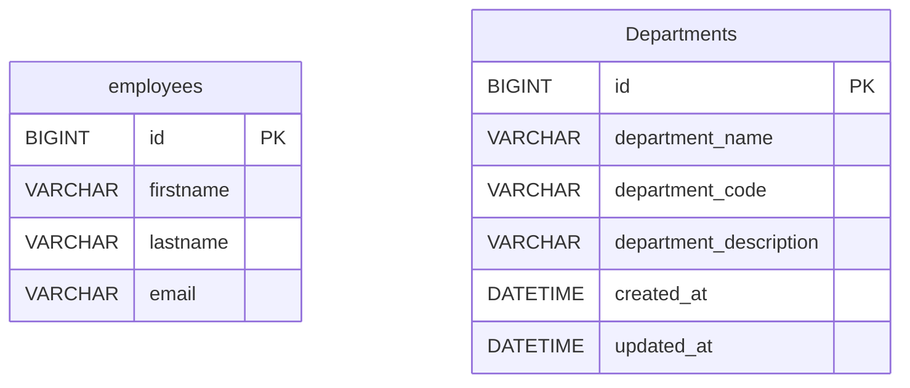
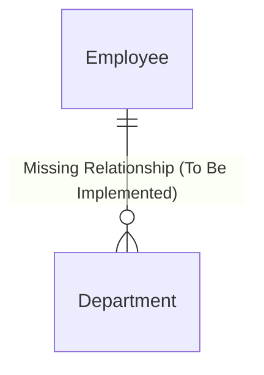

# Employee Management System - Project Documentation

## 1. Complete Architecture Diagram

The project follows a standard monolithic full-stack architecture:

```mermaid
graph TD
    Client[Client Browser]
    
    subgraph Frontend [React SPA (Vite)]
        UI[React Components/Pages]
        State[React Hooks - useState/useEffect]
        Axios[Axios HTTP Client]
        
        UI --> State
        State --> Axios
    end
    
    subgraph Backend [Spring Boot Application]
        Controller[REST Controllers]
        Service[Service Layer]
        Repository[Spring Data JPA Repositories]
        
        Controller --> Service
        Service --> Repository
    end
    
    Database[(MySQL Database)]
    
    Client -->|HTTP/REST| UI
    Axios -->|JSON over HTTP| Controller
    Repository -->|JDBC/Hibernate| Database
```

---

## 2. Database Diagram

**Database:** MySQL (`empjay`)



---

## 3. Entity Relationship Diagram (ERD)

*Note: Currently, there is **no explicit relationship** mapped between the `Employee` and `Department` entities in the Java code or Database (e.g., no `@ManyToOne` or Foreign Keys exist). They are independent tables.*



---

## 4. API Documentation

### Employee API (Base URL: `/api/employees`)
| Method | URL | Request Body | Response | Status Code | Business Logic |
|---|---|---|---|---|---|
| `POST` | `/` | `EmployeeDto` (firstname, lastname, email) | `EmployeeDto` | 201 Created | Maps DTO to Entity, saves to DB, returns saved DTO. |
| `GET` | `/` | None | `List<EmployeeDto>` | 200 OK | Fetches all employees, maps to DTO list. |
| `GET` | `/{id}` | None | `EmployeeDto` | 200 OK | Fetches employee by ID. Throws 404 if not found. |
| `PUT` | `/{id}` | `EmployeeDto` | `EmployeeDto` | 200 OK | Updates firstname, lastname, email of existing employee. |
| `DELETE` | `/{id}` | None | `String` (Success Message) | 200 OK | Deletes employee by ID. Throws 404 if not found. |

### Department API (Base URL: `/api/department`)
| Method | URL | Request Body | Response | Status Code | Business Logic |
|---|---|---|---|---|---|
| `POST` | `/` | `DepartmentDto` | `DepartmentDto` | 201 Created | Saves department, auto-generates `createdAt` & `updatedAt`. |
| `GET` | `/` | None | `List<DepartmentDto>` | 200 OK | Fetches all departments. |
| `GET` | `/{id}` | None | `DepartmentDto` | 200 OK | Fetches department by ID. Throws 404 if not found. |

---

## 5. Frontend Flow Diagram

```mermaid
graph TD
    App[App.jsx - BrowserRouter]
    
    App --> Routes
    
    Routes --> Dashboard[/ "/"]
    Routes --> EmployeeList[/ "/employees"]
    Routes --> AddEmployee[/ "/add-employee"]
    Routes --> UpdateEmployee[/ "/update-employee/:id"]
    Routes --> About[/ "/about"]
    Routes --> NotFound[/ "*"]
    
    EmployeeList --> AxiosList[EmployeeService.listEmployees]
    AddEmployee --> AxiosAdd[EmployeeService.addNewEmployee]
    UpdateEmployee --> AxiosUpdate[EmployeeService.updateEmployee]
    
    AxiosList --> SpringBoot[(Spring Boot API)]
    AxiosAdd --> SpringBoot
    AxiosUpdate --> SpringBoot
```

**State Management:** Local Component State (`useState`), Lifecycle Management (`useEffect`).

---

## 6. Existing Features
- **Backend:** 
  - Complete CRUD APIs for Employees.
  - Partial APIs (Create, Read All, Read by ID) for Departments.
  - Basic manual Exception Handling (`ResourceNotFoundException`).
  - DTO Pattern implementation using manual Mappers.
- **Frontend:**
  - Responsive UI with Bootstrap & Bootstrap Icons.
  - Routing via `react-router-dom`.
  - Dashboard, About, and Not Found pages.
  - View all employees with client-side Search and Sort functionalities.
  - Add & Update employee forms with client-side basic validation.
  - Delete employee functionality with confirmation modal.
  - Toast notifications for success states.

---

## 7. Missing Features
- **Frontend Integration for Departments:** No UI (Pages, Routes, or Services) to manage Departments.
- **Employee-Department Link:** Employees cannot currently be assigned to a department. 
- **Pagination and Server-side Sorting/Filtering:** Frontend fetches ALL employees at once, which will not scale.
- **Global Exception Handler:** The backend lacks an `@ControllerAdvice` class to catch and format exceptions uniformly (e.g., standardizing the JSON response for errors).
- **Update/Delete Department APIs:** The backend `DepartmentController` is missing `PUT` and `DELETE` endpoints.

---

## 8. Technical Debt
- **Missing `@CrossOrigin`:** The `DepartmentController` lacks `@CrossOrigin`, which will cause CORS errors when frontend integration is eventually built.
- **Manual Mapping:** Currently using manual Mapper classes (`EmployeeMapper`, `DepartmentMapper`) instead of libraries like `MapStruct`, which introduces boilerplate code.
- **Backend Validation:** No Java Bean Validation (e.g., `@NotBlank`, `@Email`) on DTOs. Invalid data can easily reach the database if API is called via Postman/cURL.
- **Hardcoded Strings:** Magic strings are used in Exceptions and basic response texts instead of constants or localized message files.

---

## 9. Security Issues
- **No Authentication / Authorization:** The application is completely open. Anyone with the URL can manipulate the database.
- **Permissive CORS Policy:** `@CrossOrigin("*")` in `EmployeeController` allows requests from absolutely any origin, posing a CSRF/data leakage risk in production.
- **Database Credentials:** `application.properties` uses `root` with no password, which is insecure for production. (Though environment variables are commented out, they should be strictly enforced).
- **SQL Injection/XSS Vulnerabilities:** While JPA prevents basic SQL injection, the lack of input validation and sanitation leaves the app vulnerable to malicious data entry.

---

## 10. Production Readiness Score

**Score:** `3.5 / 10`

**Reasoning:**
While the foundation is solid (clean layered architecture, DTO pattern, React hooks), it is heavily lacking in production requirements:
1. No Security or Identity Management.
2. Incomplete Features (Departments exist in backend but not frontend; no relationships).
3. Scalability flaws (no pagination).
4. Data integrity risks (no backend validation). 
5. Configuration management needs standardizing (active profiles, secure credential injection).

*Do not deploy to production until security, validation, and relationships are properly implemented.*
